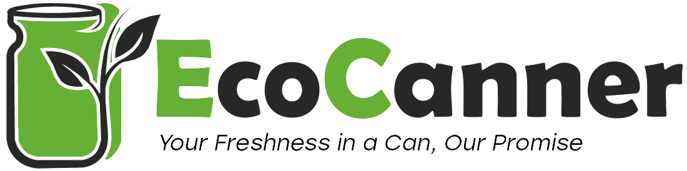

# EcoCanner: Modernizing Food Canning 🌱  

EcoCanner is a powerful and intuitive desktop application designed to revolutionize the food canning industry. 
It centralizes operations such as product tracking, client management, and resource monitoring, all while championing sustainability. 🚀  

## 🌟 Features  
- **Real-Time Tracking:** Monitor products and resources efficiently.  
- **CRUD Operations:** Seamlessly manage products, clients, invoices, and machines.  
- **Secure Access:** Password-protected access to ensure data security.  
- **PDF Export:** Generate detailed reports for better record-keeping.  
- **History Tracking:** Maintain logs of product modifications for accountability.  
- **Sort/Search Tools:** Streamlined data retrieval for efficiency.  
- **Arduino Automation:**  
  - RFID authentication paired with LCD displays for secure access.  
  - Automated machinery monitoring, temperature tracking, and proactive maintenance alerts.  
- **Automated Notifications:** Email alerts for critical product thresholds.  

## 🔧 My Contributions  
### Core Functionality Development:  
- Designed and implemented features such as:  
  - Real-time tracking.  
  - CRUD operations.  
  - PDF export and advanced statistics.  
  - History tracking for product modifications.  
  - Automated email notifications.  
### Arduino Integration:  
- Developed hardware interaction features, including RFID authentication and temperature monitoring.  
### UI/UX Design:  
- Engineered an intuitive and user-friendly interface for centralized management.  
### Collaboration:  
- Worked closely with my team to solve technical challenges and meet project milestones.  

## 🛠️ Built With  
- **C++ Programming Language**  
- **Qt Framework**  

## 📽️ Media  
- [EcoCanner Demo](https://drive.google.com/file/d/19KB3gZTQs8vhLpyWvqFBaUXHorK2SCL0/view?usp=sharing)  

## 🔓 Accessing the Code  
To request access to the source code of EcoCanner, please contact me via LinkedIn. I’d be happy to discuss the project and share the code upon request.  

## 🤝 Acknowledgments  
A huge thank you to my amazing team for their dedication and collaboration in making EcoCanner a success!
